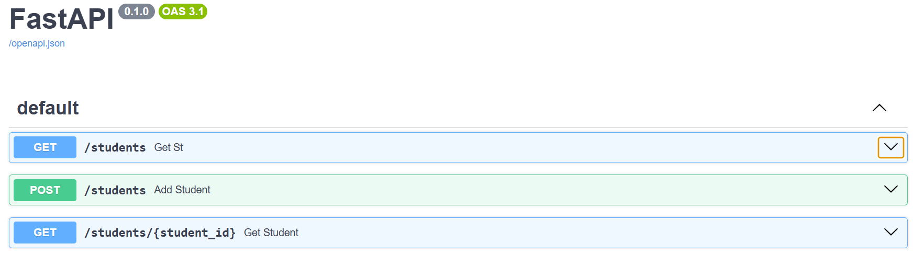

# Student Management REST API

A simple REST API built with FastAPI as part of my Backend Development internship at DecodeLabs.

## Features

- Retrieve students using query parameters
- Retrieve a student using a path parameter
- Add new students using POST requests
- Pydantic-based request validation
- HTTP 404 error handling
- Automatic interactive API documentation with Swagger UI

## Technologies

- Python
- FastAPI
- Pydantic
- Uvicorn

## API Endpoints

### GET /students

Returns students filtered by age and department.

Example:

GET /students?age=19&department=Computer%20Engineering

### GET /students/{student_id}

Returns a specific student using their ID.

Example:

GET /students/3

If the student does not exist, the API returns:

```json
{
  "detail": "Student not found"
}
```
### POST /students

Adds a new student to the student list.

The request body must contain:

name
age
department

Example request:

{
  "name": "Ahmed",
  "age": 20,
  "department": "Computer Engineering"
}

Example response:

{
  "id": 6,
  "name": "Ahmed",
  "age": 20,
  "department": "Computer Engineering"
}

The request data is validated using a Pydantic model before the student is added.

Note: Since this project currently uses an in-memory Python list rather than a database, newly added students are lost when the server is restarted
## API Documentation

The API includes interactive Swagger documentation:


